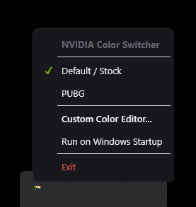

# 🟢 NVIDIA Color Switcher

> A modern, lightweight, high-performance Windows desktop application to switch, calibrate, and manage NVIDIA Digital Vibrance, Brightness, Contrast, and Gamma color profiles in real-time.


*Modern Dark UI with compact real-time calibration controls, preset management, and Segoe MDL2 vector icons.*

---

## ✨ Key Features

- 🌈 **Real-Time Hardware Calibration**: Directly adjust **Digital Vibrance** via native NVIDIA NVAPI hardware SDK, with fallback to Windows GDI linear identity ramps for Brightness, Contrast, and Gamma.
- 🎯 **Preset Profile Management**: Save, update, switch, and delete custom color calibration profiles tailored for Gaming, Movies, Productivity, or Night Reading.
- 🚀 **Windows Auto-Startup**: One-click toggle to launch silently on Windows boot (`HKCU\Software\Microsoft\Windows\CurrentVersion\Run`).
- 📌 **System Tray Integration**: Easily switch profiles from the background System Tray icon, with instant minimization (`Esc` / `✕`).
- ⚡ **Always-Enabled Apply & Live Preview**: Real-time slider feedback with instant Apply capability.
- 🔒 **Safe Hardware Reset**: One-click reset to restore hardware defaults to original NVIDIA NVAPI `DefaultLevel` and GDI 1:1 linear ramps.
- 📦 **Single File Executable**: Can be built into a standalone single `.exe` file with zero extra runtime dependencies required.

---

## 📸 Screenshots

| Custom Color Editor | System Tray Context Menu |
| :---: | :---: |
|  |  |

---

## 🚀 Quick Start (Download)

1. Download the latest release executable from the [Releases](https://github.com/PrmWiny/Nvidia-Color-Profile-Setting/releases) section.
2. Double-click **`NvidiaColorSwitcher.exe`** to launch.
3. Adjust your preferred Digital Vibrance, Brightness, Contrast, and Gamma values, then click **💾 Save** to create your custom preset.

---

## 🛠️ Building from Source

### Prerequisites
- [.NET 8.0 SDK](https://dotnet.microsoft.com/download/dotnet/8.0) or later
- Windows 10 / 11 (x64)
- NVIDIA GPU & Drivers (for NVAPI Digital Vibrance control)

### Publishing Executable
Run the dotnet publish command:
```powershell
dotnet publish -c Release -r win-x64 --self-contained true -p:PublishSingleFile=true -p:IncludeNativeLibrariesForSelfExtract=true -o ./dist
```

---

## 🛠️ Tech Stack & Architecture

- **Framework**: .NET 8.0 (WPF / C#)
- **NVIDIA Integration**: [NvidiaUserAPI](https://github.com/NvidiaUserAPI) (NVAPI P/Invoke wrapper for DVC)
- **System Tray**: [H.NotifyIcon.Wpf](https://github.com/HavenDV/H.NotifyIcon)
- **Design System**: Dark Mode Palette with Segoe MDL2 Assets Vector Icons

---

## 📄 License

Distributed under the MIT License. See `LICENSE` for more information.

Developed by [PrmWiny](https://github.com/PrmWiny).
